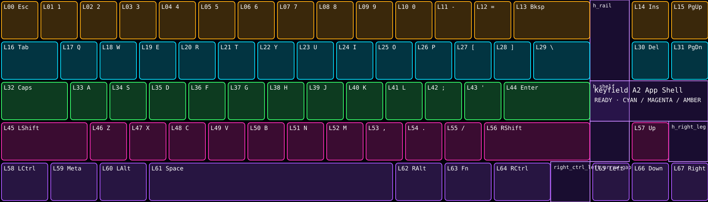

# CPPRO UE Skins

An independent, experimental authoring kit for original interactive Unreal
Engine skins on the Finalmouse Centerpiece Pro.

This repository packages the useful result of the work—not the lab notebook.
It contains a minimal UE4.27 project, a clean-room SkinApi authoring stub, the
physically calibrated key layout, designer tools, and complete device-tested
examples. It does **not** contain captures, firmware, vendor software, extracted
official skins, exploratory probes, or private development artifacts.

> This is not an official Finalmouse SDK. Custom PAK loading is experimental
> and can reset a skin slot if a build crashes. Keep another known-good slot
> available and use a nonessential slot while developing.




## Skins available

| Skin | Type | What it demonstrates | Download and documentation |
| --- | --- | --- | --- |
| Keyfield A2 | Interactive app shell | All 68 mapped keys, press/release effects, palettes, readable display regions, and Ready/Live/Paused states | [Keyfield A2](examples/keyfield-a2/README.md) |
| Keyfield Pulse | Daily interactive skin | Clean always-live key lights, hold-sensitive releases, three-stage waves, and a persistent Caps indicator | [Keyfield Pulse](examples/keyfield-pulse/README.md) |
| Moodfield | Adaptive living surface | Persistent typing geography, compact-pattern recognition, active/retained/afterglow phases, and Caps state | [Moodfield](examples/moodfield/README.md) |
| Koi Pond | Living physics sandbox | Full-screen artwork, animated koi, continuous swimming, water ripples, and key-position physics impulses | [Koi Pond](examples/koi-pond/README.md) |
| Koi Pond: Caps Indicator | Stateful utility skin | Koi Pond plus a session-local Caps Lock indicator with a persistent, edge-latched toggle | [Koi Pond: Caps Indicator](examples/koi-pond-caps-indicator/README.md) |

Each example includes its exact release PAK and SHA-256 checksum. Koi Pond also
includes its original artwork, generated animation frames, frame-preparation
tool, editable UE4.27 assets, and canonical source-map snapshot. Browse the
complete [examples index](examples/README.md) for controls and source contents.

## Desktop skin loader

[CPPRO Skin Loader](apps/windows-loader/README.md) is the dead-simple desktop
path: choose a developer skin or local `.pak`, choose slot 1–5, and send it to
the keyboard. Windows is physically confirmed; Linux/WSL and Apple Silicon and
Intel macOS candidates share the same protocol implementation and packaging
pipeline.

The application retrieves its library when it opens, so newly published skins
appear without an application update. The library is scrollable and sortable
by newest, A–Z, or GitHub Release download count. Download the current
cross-platform candidate from the
[v0.2.0-beta.1 prerelease](https://github.com/LeiterConsulting/cppro-ue-skins/releases/tag/v0.2.0-beta.1).

New examples follow one documented
[skin library standard](examples/SKIN_STANDARD.md). A generator validates their
metadata, PAK version, checksum, and release information, then produces the
catalog consumed by the application.

## What works

- UE4.27 Android ASTC content packaged as PAK version 11.
- Canonical entry map `/Game/map/M_EntryPoint`.
- 1920×550 device viewport.
- All 68 physically mapped key regions.
- SkinApi `OnKeyEvent(HCode, IsActuated, Percentage)` binding.
- Reliable per-key press and release edges.
- Bounded UMG animation, pooled key effects, and application states.
- Hybrid UMG/physics scenes with animated actors and key-position impulses.
- CPU and GPU Niagara systems, including pooled components and custom
  particle materials.
- Readable content in the keyboard's key-free display regions.
- Direct, explicit PAK upload to slots 1–5.

The installed device runtime currently reports `Percentage=100` for a press;
continuous analog depth is not available to the skin callback. The keyboard's
analog travel is visible in host-side USB traffic, but that does not imply that
the Android Unreal runtime forwards it to `OnKeyEvent`. Design device skins
around `IsActuated`, hold duration, cadence, and accumulated state unless later
firmware proves otherwise.

## Repository map

| Path | Purpose |
| --- | --- |
| `project/` | Minimal editable UE4.27 `spark` project and SkinApi stub |
| `examples/keyfield-a2/` | App-state and calibrated keyfield example |
| `examples/keyfield-pulse/` | Clean always-live keyfield skin with Caps state |
| `examples/moodfield/` | Adaptive substrate with rolling spatial memories and pattern modes |
| `examples/koi-pond/` | Living physics scene, original art, source map, and PAK |
| `examples/koi-pond-caps-indicator/` | Koi Pond variant with a persistent Caps Lock toggle |
| `examples/SKIN_STANDARD.md` | Contract and checklist for publishing a library skin |
| `catalog/skins.json` | Generated catalog consumed by the Windows loader |
| `apps/windows-loader/` | Cross-platform skin library and slot loader |
| `layout/` | Calibrated display geometry and native index map |
| `schemas/` | JSON contracts for skins, profiles, and themes |
| `tools/build-skin-catalog.py` | Validate examples and generate the loader catalog |
| `tools/cppro_skin_kit.py` | Validate, preview, and lock designer inputs |
| `tools/build-pak.ps1` | Cook Android ASTC and create a slot-compatible PAK |
| `tools/verify-pak.ps1` | Check integrity, mount layout, map, and SHA-256 |
| `tools/cppro_upload.py` | Dry-run-by-default slot installer |
| `reference/runtime/` | Dependency-free input/state/profile reference model |
| `docs/` | Setup, authoring, packaging, input, and safety guides |

## Quick start

Requirements:

- Windows 10/11
- Unreal Engine **4.27**
- UE4.27 Android toolchain configured for Android ASTC cooking
- PowerShell 5.1 or newer
- Python 3.10+; `pywinusb` is needed only for uploading

Clone and validate the included design:

```powershell
git clone https://github.com/LeiterConsulting/cppro-ue-skins.git
cd cppro-ue-skins

python tools/cppro_skin_kit.py validate `
  examples/keyfield-a2/manifest/skin.json

python tools/cppro_skin_kit.py preview `
  examples/keyfield-a2/manifest/skin.json `
  --out artifacts/keyfield-a2.svg

python -m unittest discover -s reference/runtime -v
```

Open `project/spark.uproject` in UE4.27. The included startup map launches
Keyfield A2. Duplicate the A2 actor/widget into a new content folder, edit the
copy, place it in `/Game/map/M_EntryPoint`, and keep that canonical map path.

Build:

```powershell
./tools/build-pak.ps1 `
  -EngineRoot 'D:\Epic Games\UE_4.27' `
  -OutPak '.\artifacts\my_skin.pak'
```

Verify:

```powershell
./tools/verify-pak.ps1 `
  -Pak '.\artifacts\my_skin.pak' `
  -EngineRoot 'D:\Epic Games\UE_4.27'
```

Upload only after reviewing the safety guide:

```powershell
python -m venv .venv
./.venv/Scripts/pip.exe install -r requirements.txt

# Dry run: prepares and describes the transfer without touching the keyboard.
./.venv/Scripts/python.exe tools/cppro_upload.py `
  --slot 5 --pak .\artifacts\my_skin.pak

# Explicit device write.
./.venv/Scripts/python.exe tools/cppro_upload.py `
  --slot 5 --pak .\artifacts\my_skin.pak --send --activate
```

Start with [Getting Started](docs/getting-started.md), then read the
[Authoring Guide](docs/authoring-guide.md) and
[Safety and Compatibility](docs/safety-and-compatibility.md). Particle-effect
authors should also read the [Niagara guide](docs/niagara.md).

## Keyfield A2

The included example PAK was physically accepted and remained stable while
typing. It starts in Ready, Enter begins/resumes, Escape pauses, Backspace
resets, and Tab cycles palettes. Its exact SHA-256 is:

```text
639F4258E74B0230C37D7F62F8AB541D6B8E829CAC6CA1D19A7E5E36D4BDFDA4
```

See [examples/keyfield-a2/README.md](examples/keyfield-a2/README.md).

## Keyfield Pulse

Keyfield Pulse is a clean, always-live interpretation of the proven Keyfield
effects. It removes A2's calibration and app-shell UI while retaining all 68
mapped key lights, hold-sensitive release pads, and three-stage waves. A
session-local, edge-latched orange layer provides a visible Caps Lock state.

Its exact device-tested PAK, editable UE4.27 assets, canonical map snapshot,
manifest, preview, and checksum are included. See
[examples/keyfield-pulse/README.md](examples/keyfield-pulse/README.md).

## Koi Pond

Koi Pond is a full-keyboard ambient physics sandbox. Six animated koi roam over
an underwater scene; every physical key produces a three-stage water ripple and
an impulse at that key's calibrated position. The example demonstrates shared
sprite animation, persistent steering, world-to-UMG synchronization, bounded
physics, and crop-safe full-viewport artwork.

Its exact release PAK, editable UE4.27 assets, canonical map snapshot,
ChatGPT-created source artwork, generated animation frames, and reproduction
tool are included. See
[examples/koi-pond/README.md](examples/koi-pond/README.md).

## Moodfield

Moodfield converts timing and spatial usage into a persistent full-screen
substrate. Ordinary typing builds a weighted geography from six slow alpha-row
memories, while compact control clusters and a fast WASD path create focused
regional moods. Individual presses deform the same surface instead of drawing
detached key rectangles.

The included release adds an active-to-afterglow lifecycle, progressive
re-engagement after pauses, honest number-row and arrow-mode limitations, and
the session-local Caps indicator. Its exact PAK, runtime overlay, canonical
map, generated material source, Blueprint authoring library, manifest, preview,
checksum, and architecture guide are included. See
[examples/moodfield/README.md](examples/moodfield/README.md).

## Koi Pond: Caps Indicator

This additional example retains the complete Koi Pond experience and adds an
orange translucent state layer under the physical Caps Lock key. A dedicated
integer state and press-edge latch make the indicator alternate once per
physical press even when the analog keyboard repeats actuated reports while a
key is held.

The state is device-session-local: the confirmed callback does not expose the
host operating system's lock state or composed characters. See
[examples/koi-pond-caps-indicator/README.md](examples/koi-pond-caps-indicator/README.md).

## License and support

This is an early community authoring surface built from confirmed behavior, not
a vendor-supported compatibility promise. It is provided free of charge and
without warranty or support.

Original project code, documentation, manifests, tooling, and example artwork
are open source under the [MIT License](LICENSE). You may use, modify,
redistribute, sublicense, or sell copies subject to the license's short notice
requirement. Third-party technology and trademarks remain subject to their own
terms; see [NOTICE.md](NOTICE.md).
