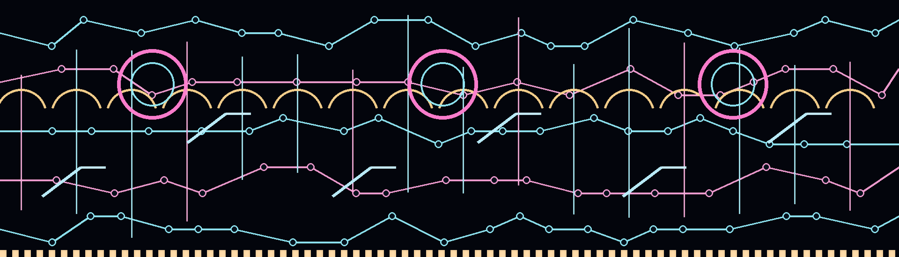

# Circuit Stunt Show

Circuit Stunt Show transforms the CPPRO into a neon circuit-board arena.
Twelve tiny riders cruise between traces, ramps, loops, and landing platforms.
Key presses place persistent stunt markers at their physical locations, so
four independent three-rider crews can cross the board toward different jobs
while the arena continues pulsing.



## What it demonstrates

- A full-screen 1920×550 illustrated circuit arena.
- Two continuously moving current-and-spark layers with safe edge bleed.
- Twelve animated riders driven by bounded physics proxies.
- Exact localized input for all 68 confirmed native key indices.
- Four simultaneous stunt/repair sites and independent crews.
- Sixteen rider states covering cruise, airborne, alarm, and landing.
- A session-local Caps Lock indicator beneath the physical Caps key.

## Behavior

| Input | Response |
| --- | --- |
| Press a key | A neon landing marker appears at the physical key |
| Release the key | The site persists and fades while its crew responds |
| Type across separated regions | Up to four rider crews cross the circuit independently |
| Stop typing | Riders complete their current sites and resume free cruising |
| Press Caps Lock | The thematic Caps layer alternates once per physical press |

## Contents

| Path | Purpose |
| --- | --- |
| `ARCHITECTURE.md` | Runtime composition, input routing, work channels, and limits |
| `ARTWORK.md` | Original art provenance, asset dimensions, and regeneration |
| `generated/art/` | Circuit, current, spark, marker, and rider PNGs used in the release |
| `tools/generate-cleanroom-trio-assets.py` | Deterministic Pillow artwork generator |
| `project-overlay/CPPRO/MenderSwarmA1/` | Editable actor, widget, and imported texture assets |
| `project-map/M_EntryPoint.umap` | Canonical source map |
| `release/cppro_circuit_stunt_show_a1.pak` | Device-tested release artifact |
| `library.json` | Desktop-loader metadata |

## Load the included PAK

Review [Safety and Compatibility](../../docs/safety-and-compatibility.md), then:

```powershell
./tools/verify-pak.ps1 `
  -Pak .\examples\circuit-stunt-show\release\cppro_circuit_stunt_show_a1.pak `
  -EngineRoot 'D:\Epic Games\UE_4.27' `
  -ExpectedAssets `
    'spark/Content/CPPRO/MenderSwarmA1/BP_MenderSwarmA1.uasset', `
    'spark/Content/CPPRO/MenderSwarmA1/WBP_MenderSwarmA1.uasset', `
    'spark/Content/CPPRO/MenderSwarmA1/Textures/Substrate_Base.uasset', `
    'spark/Content/CPPRO/MenderSwarmA1/Textures/Damage_Tear.uasset'
```

Dry run:

```powershell
./.venv/Scripts/python.exe tools/cppro_upload.py `
  --slot 3 `
  --pak .\examples\circuit-stunt-show\release\cppro_circuit_stunt_show_a1.pak
```

Write and activate:

```powershell
./.venv/Scripts/python.exe tools/cppro_upload.py `
  --slot 3 `
  --pak .\examples\circuit-stunt-show\release\cppro_circuit_stunt_show_a1.pak `
  --send --activate
```

The release is 32,832,265 bytes. Its SHA-256 is:

```text
EB17B7E12350E4B484C5A0082055A351DF879772AEABCF1D133A800EB5DB38DB
```

The PAK passed UnrealPak integrity checks and was uploaded and activated on
physical hardware in slot 3.

## Open and edit the exact source

```powershell
Copy-Item `
  .\examples\circuit-stunt-show\project-overlay\CPPRO\MenderSwarmA1 `
  .\project\Content\CPPRO\ `
  -Recurse -Force

Copy-Item `
  .\examples\circuit-stunt-show\project-map\M_EntryPoint.umap `
  .\project\Content\map\M_EntryPoint.umap `
  -Force
```

Open `project/spark.uproject` in UE4.27. Preserve
`/Game/CPPRO/MenderSwarmA1` and `/Game/map/M_EntryPoint`.

Regenerate the exact artwork:

```powershell
python .\examples\circuit-stunt-show\tools\generate-cleanroom-trio-assets.py
```

The installed runtime reports `Percentage=100`, so the skin uses press/release
edges, position, and time rather than continuous analog depth.
