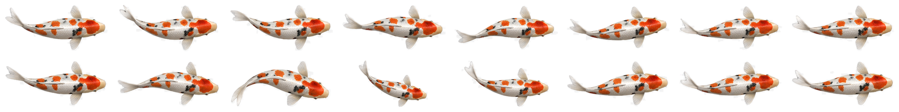

# Koi Pond artwork

## Provenance

The pond background and koi atlas were created with ChatGPT at the repository
owner's direction for this original skin. They are not extracted from an
official Finalmouse skin or a third-party asset pack.

They are included under `source-art/` as the editable visual starting point.
The repository owner makes this original artwork available under the root
[MIT License](../../LICENSE). Third-party technology remains subject to its own
terms as described in [NOTICE.md](../../NOTICE.md).




## Source files

| File | Format | Dimensions | Purpose |
| --- | --- | ---: | --- |
| `pond-background-chatgpt.jpg` | RGB JPEG | 1281×366 | Full-keyboard underwater base |
| `koi-atlas-chatgpt.png` | RGBA PNG | 2048×256 | Two rows of eight 256×128 poses |

Source SHA-256 values are recorded in `source-art/SHA256SUMS.txt`.

The pond's rocks and plants are depicted below the water surface. They are part
of the base image and do not require separate collision or foreground masks.

## Atlas contract

The atlas uses an 8×2 grid:

```text
frame width:   256 px
frame height:  128 px
columns:       8
rows:          2
atlas size:    2048×256 px
```

- Row 0 is the looping cruise sequence.
- Row 1 is a pronounced turn/reaction sequence reserved for future behavior.
- Transparent pixels must contain real alpha, not a checkerboard pattern.
- Every pose should face the same base direction and occupy a consistent
  centerline.
- Keep fins and tail inside the 256×128 frame with enough transparent margin to
  prevent clipping during rotation.

## Runtime frames

The skin uses 16 individual 256×128 RGBA textures named:

```text
Koi_Cruise_00.png
...
Koi_Cruise_15.png
```

The eight first-row source poses are extracted as `Source_00.png` through
`Source_07.png`. FFmpeg's motion-compensated interpolation adds one in-between
pose between each source pose, including the loop seam. This doubles temporal
resolution without increasing the source-art burden.

Requirements:

- Python 3.10+
- Pillow 12.1.0
- FFmpeg available on `PATH`

Rebuild:

```powershell
python examples/koi-pond/tools/prepare-koi-frames.py `
  examples/koi-pond/source-art/koi-atlas-chatgpt.png `
  examples/koi-pond/generated/koi-cruise
```

Use `--source-only` to skip interpolation and repeat the eight original poses
across the 16 runtime names.

The generated contact sheet is 1044×532 and arranges the 16 cruise frames in a
4×4 grid with four-pixel gutters.

## Pond image contract

The logical device canvas is 1920×550, or approximately 3.49:1. The included
1281×366 image is close to the same ratio and is stretched uniformly into the
widget's full-viewport image slot.

Provide artwork that:

- remains legible through transparent switches and keycaps;
- avoids important small details directly beneath switch stems;
- can tolerate 16 px horizontal and 8 px vertical crop-safe bleed;
- reaches every edge with natural texture;
- does not place a visible frame or bright border at the image boundary.

For a different pond, replace both the source image and the imported
`Pond_Base` texture in UE4.27. Preserve the viewport anchors and bleed unless a
new physical calibration proves they are unnecessary.

## Optional future layers

The current example intentionally keeps the presentation simple. Compatible
additions include:

- a sparse foreground caustics overlay;
- floating leaves above the koi;
- a second atlas for turn/reaction poses;
- small impact particles pooled per key region;
- a subtle depth tint per fish size.

Keep every addition bounded and prefer shared textures over per-fish copies.
