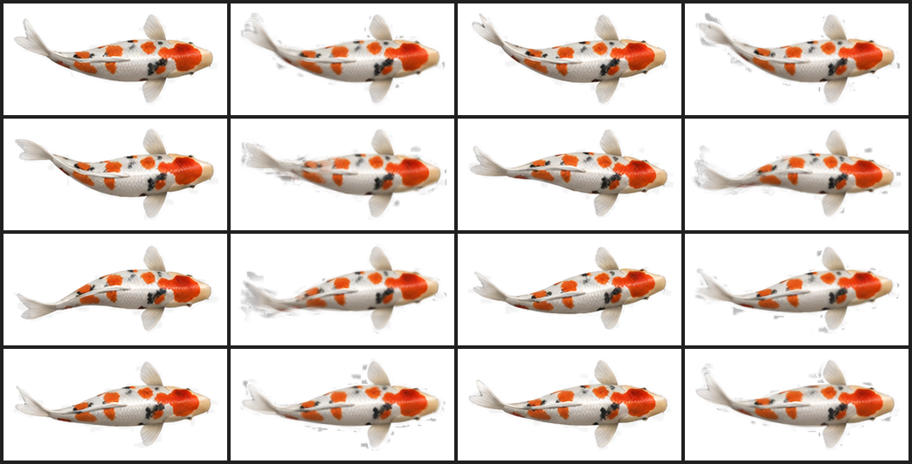
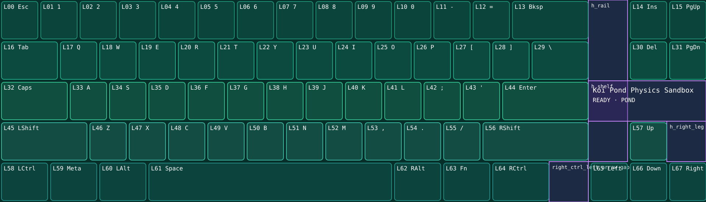

# Koi Pond

Koi Pond is a living, full-keyboard physics sandbox. Six animated koi travel
continuously across an underwater scene. Pressing any physical key creates a
water ripple at that key and applies a local impulse to nearby fish.

This example is designed to show what a CPPRO skin can feel like when the
keyboard is treated as one interactive display rather than 68 isolated lights.
It contains no HUD or telemetry; the pond, fish, and input response are the
entire experience.





## What it demonstrates

- Full 1920×550 artwork with viewport-anchored crop-safe bleed.
- All 68 native `HCode` values mapped to their physical key positions.
- Three preallocated ripple rings per key, with no keypress spawning.
- Six persistent physics proxies with continuous steering and separation.
- Key-position sphere traces and local radial impulses.
- Six UMG koi sprites synchronized to the physics world.
- A shared 16-frame, true-alpha cruise animation with per-fish phase offsets.
- Turn-rate-limited sprite headings and a low-speed heading deadband.
- Device-resident fallback materials that remain unobtrusive if an edge is
  exposed.

The implementation is explained in [ARCHITECTURE.md](ARCHITECTURE.md).
Artwork specifications, provenance, and replacement instructions are in
[ARTWORK.md](ARTWORK.md).

## Controls

Every key has the same semantic action: disturb the pond at that key's physical
center. The size and location of long keys are taken from the calibrated layout,
so Space, Enter, Shift, and Backspace affect their actual display regions.

The device callback is treated as binary. `IsActuated=true` triggers the
interaction; `Percentage` is not used because the tested runtime reports 100
for presses rather than continuous analog travel.

The manifest profile names Space as a representative `disturb_pond` binding
because the current profile schema records semantic controls. The UE runtime
does not special-case Space: every native layout index uses the same
position-aware interaction path.

## Contents

| Path | Purpose |
| --- | --- |
| `source-art/` | Original ChatGPT-created pond and transparent koi atlas |
| `generated/koi-cruise/` | Eight source poses, 16 runtime frames, contact sheet |
| `tools/prepare-koi-frames.py` | Rebuild the runtime sequence from the atlas |
| `manifest/` | Validated design contract, profile, and pond theme |
| `project-map/M_EntryPoint.umap` | Exact canonical source map for this example |
| `release/cppro_koi_pond.pak` | Exact device upload artifact |
| `../../project/Content/CPPRO/TouchPoolL1/` | Editable UE4.27 actor and widget |
| `../../project/Content/Game/Physics/` | Pond proxy physical material |

The internal UE folder remains named `TouchPoolL1` because cooked asset
references are path-sensitive. The public example name is Koi Pond.

## Load the included PAK

Review [Safety and Compatibility](../../docs/safety-and-compatibility.md), then
verify the artifact:

```powershell
./tools/verify-pak.ps1 `
  -Pak .\examples\koi-pond\release\cppro_koi_pond.pak `
  -EngineRoot 'D:\Epic Games\UE_4.27' `
  -ExpectedAssets `
    'spark/Content/CPPRO/TouchPoolL1/BP_TouchPoolL1.uasset', `
    'spark/Content/CPPRO/TouchPoolL1/WBP_TouchPoolL1.uasset'
```

Prepare a dry run:

```powershell
./.venv/Scripts/python.exe tools/cppro_upload.py `
  --slot 5 `
  --pak .\examples\koi-pond\release\cppro_koi_pond.pak
```

Write only when ready:

```powershell
./.venv/Scripts/python.exe tools/cppro_upload.py `
  --slot 5 `
  --pak .\examples\koi-pond\release\cppro_koi_pond.pak `
  --send --activate
```

The release is 33,011,080 bytes. Its SHA-256 is:

```text
55768C1CEA8B41FD79377778E45DEDEE2AF9B1D40DF06C1274BE7F8272F5D7FC
```

The upload and activation path was verified on physical hardware in slot 5.

## Open and edit the source

The repository's default `/Game/map/M_EntryPoint` launches Keyfield A2. Before
opening Unreal, replace it with the included Koi Pond map snapshot:

```powershell
Copy-Item `
  .\examples\koi-pond\project-map\M_EntryPoint.umap `
  .\project\Content\map\M_EntryPoint.umap `
  -Force
```

Open `project/spark.uproject` in UE4.27. The source assets appear under
`/Game/CPPRO/TouchPoolL1`. Make changes in copies when exploring. The map
snapshot uses the canonical package path required by the device.

Restore the repository's default map at any time:

```powershell
git restore project/Content/map/M_EntryPoint.umap
```

## Build

With the Koi Pond map active:

```powershell
./tools/build-pak.ps1 `
  -EngineRoot 'D:\Epic Games\UE_4.27' `
  -OutPak '.\artifacts\cppro_koi_pond.pak'
```

The build compiles the editor target, cooks Android ASTC, stages the canonical
mount layout, creates a version-11 PAK, verifies it, and prints its checksum.
Building does not communicate with the keyboard.

The included checksum identifies the exact hardware-loaded release. A local
rebuild can have a different byte hash because Unreal cook metadata and plugin
descriptors are part of the archive; verify its mount point, canonical map,
expected assets, and integrity before loading it.

## Customize

Good first changes are:

- replace the pond image while retaining the 1920×550 presentation ratio;
- replace the atlas and regenerate the 16 cruise frames;
- change the six sprite sizes and animation phase offsets;
- tune waypoint speed, steering gain, separation, and recovery;
- change ripple diameters, opacity, tint, or stage timing;
- change fish count while keeping actors and widgets preallocated.

Keep one runtime technology change per hardware test, retain a known-good slot,
and verify release events even if a future design only reacts on presses.

## Related example

[Koi Pond: Caps Indicator](../koi-pond-caps-indicator/README.md) adds a
device-session-local Caps Lock state layer while preserving this pond's art,
swimming controller, ripples, and physics interactions.
