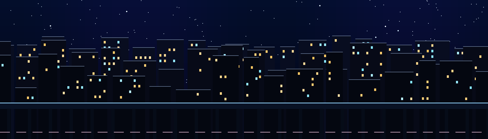

# Night Shift

Night Shift turns the entire CPPRO panel into a layered city after dark. Twelve
small service craft patrol the skyline while traffic, windows, and elevated
lanes move continuously behind them. Every mapped key press creates a
localized illuminated service call; one three-craft crew travels to that
location while the other crews continue their existing work.

The result is an ambient scene first and an input effect second. It remains
alive when the keyboard is idle, yet typing leaves several simultaneous jobs
moving through the city.



## What it demonstrates

- A full-screen 1920×550 city built for the physical keybed.
- Two oversized transparent parallax layers with safe edge bleed.
- Twelve animated service craft driven by bounded physics proxies.
- Exact localized input for all 68 confirmed native key indices.
- Four concurrent, persistent service calls and independent crews.
- Sixteen presentation frames for patrol, alarm, travel, and repair.
- Continuous idle movement with no per-press actor allocation.
- A session-local Caps Lock indicator beneath the physical Caps key.

## Behavior

| Input | Response |
| --- | --- |
| Press a key | A building-shaped service beacon appears at that physical key |
| Release the key | The call remains visible and fades as the crew completes it |
| Type across the board | Up to four calls coexist and separate crews cross the city |
| Stop typing | Craft finish their calls, then resume independent patrols |
| Press Caps Lock | The thematic Caps layer alternates once per physical press |

## Contents

| Path | Purpose |
| --- | --- |
| `ARCHITECTURE.md` | Runtime layers, bounded work model, input routing, and limits |
| `ARTWORK.md` | Original art provenance, dimensions, palette, and regeneration |
| `generated/art/` | Exact city, motion, beacon, and craft PNGs used for the release |
| `tools/generate-cleanroom-trio-assets.py` | Deterministic Pillow art generator |
| `project-overlay/CPPRO/MenderSwarmA1/` | Editable actor, widget, and imported texture assets |
| `project-map/M_EntryPoint.umap` | Canonical source map for this skin |
| `release/cppro_night_shift_a1.pak` | Device-tested slot-compatible release |
| `library.json` | Metadata compiled into the desktop loader catalog |

## Load the included PAK

Review [Safety and Compatibility](../../docs/safety-and-compatibility.md), then
verify the artifact:

```powershell
./tools/verify-pak.ps1 `
  -Pak .\examples\night-shift\release\cppro_night_shift_a1.pak `
  -EngineRoot 'D:\Epic Games\UE_4.27' `
  -ExpectedAssets `
    'spark/Content/CPPRO/MenderSwarmA1/BP_MenderSwarmA1.uasset', `
    'spark/Content/CPPRO/MenderSwarmA1/WBP_MenderSwarmA1.uasset', `
    'spark/Content/CPPRO/MenderSwarmA1/Textures/Substrate_Base.uasset', `
    'spark/Content/CPPRO/MenderSwarmA1/Textures/Damage_Tear.uasset'
```

Prepare a dry run for any slot:

```powershell
./.venv/Scripts/python.exe tools/cppro_upload.py `
  --slot 1 `
  --pak .\examples\night-shift\release\cppro_night_shift_a1.pak
```

Write only when ready:

```powershell
./.venv/Scripts/python.exe tools/cppro_upload.py `
  --slot 1 `
  --pak .\examples\night-shift\release\cppro_night_shift_a1.pak `
  --send --activate
```

The release is 32,685,168 bytes. Its SHA-256 is:

```text
A04ED446FC1190FD1747B5A436ACD9822B9F5627AA151E05566FB069C69AC6FE
```

The PAK passed UnrealPak integrity checks and was uploaded and activated on
physical hardware in slot 1. The same identity is recorded in
`release/SHA256SUMS.txt` and the generated loader catalog.

## Open and edit the exact source

Apply the overlay and map to a clean checkout:

```powershell
Copy-Item `
  .\examples\night-shift\project-overlay\CPPRO\MenderSwarmA1 `
  .\project\Content\CPPRO\ `
  -Recurse -Force

Copy-Item `
  .\examples\night-shift\project-map\M_EntryPoint.umap `
  .\project\Content\map\M_EntryPoint.umap `
  -Force
```

Open `project/spark.uproject` in UE4.27. Preserve the asset path
`/Game/CPPRO/MenderSwarmA1` and canonical map `/Game/map/M_EntryPoint`.

Regenerate the authored artwork before reimporting it:

```powershell
python .\examples\night-shift\tools\generate-cleanroom-trio-assets.py
```

The installed runtime reports `Percentage=100` for a press, so Night Shift
uses press/release edges, position, cadence, and time rather than continuous
analog depth.
